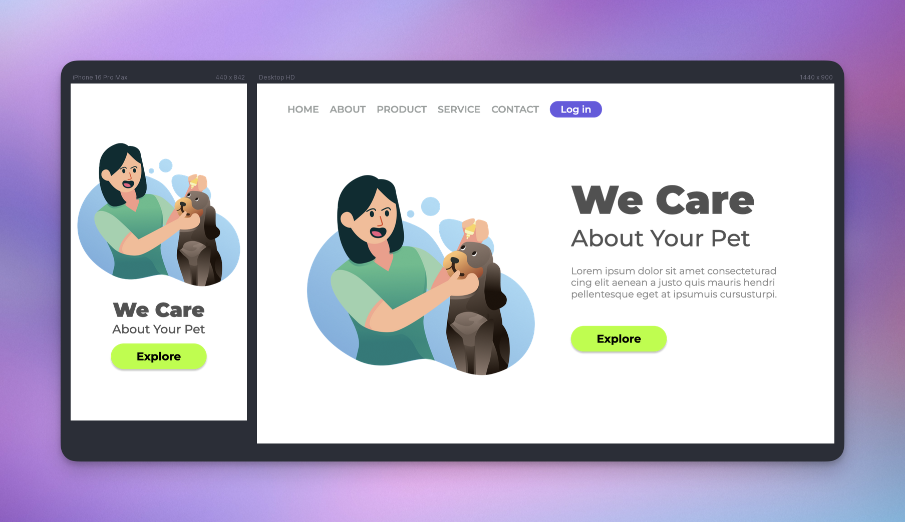

# Challenge 04: We Care

This project is a **responsive landing page** for a pet shop, created as part of my learning journey in web development.  
The original **desktop-only layout** was written during a lecture, and the objective of this project was to adapt it
into a design that works on both **mobile** and **desktop** screens, applying the concepts of responsive design.

## 📸 Screenshots

## 🔗 Link

## 👷🏻‍♀️ Built with

- HTML
- CSS

### 🚀Features

- Mobile & Desktop Layouts
- Semantic HTML
- Media Queries

## 👩🏻‍💻 Author

&nbsp;&nbsp;
&nbsp;&nbsp;

